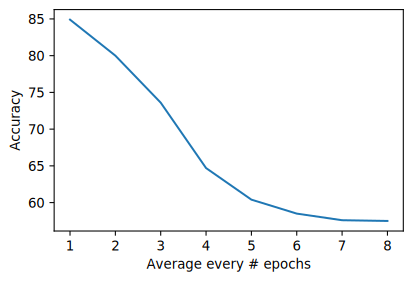
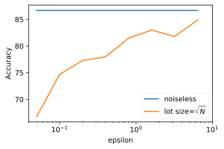
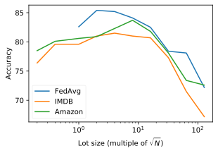
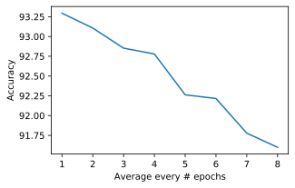
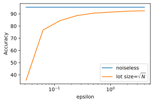
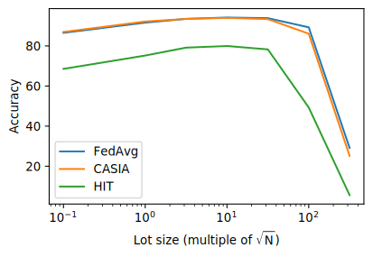

# The OARF Benchmark Suite: Characterization and Implications for Federated Learning Systems

This repository is the official implementation of The OARF Benchmark Suite: Characterization and Implications for Federated Learning Systems

## Requirements

To install requirements: enter a subdirectory (e.g. `sentiment`) and

```setup
pip install -r requirements.txt
```

To download and preproceess the data required for training the model, enter a subdirectory and run:
```preprocess
bash preprocess.sh
```

## Training & Evaluation

To reproduce the results in the paper, enter a subdirectory (e.g. `sentiment`), run one of the following command:

| Experiments                                                          | Command                     |
| -------------------------------------------------------------------- |-----------------------------|
| **Sentimen Analysis**                                                |                             |
| &nbsp;&nbsp; Improvement of federated averaging                      |`bash train_fedavg.sh`          |
| &nbsp;&nbsp; Communication cost                                      |`bash train_comm_cost.sh`       |
| &nbsp;&nbsp; Differential privacy                                    |`bash train_dp.sh`              |
| &nbsp;&nbsp; Secure multiparty compuatation                          |`bash train_smc.sh`             |
| **Chinese Character Recognition**                                    |                             |
| &nbsp;&nbsp; Improvement of federated averaging                      |`bash train_fedavg.sh`       |
| &nbsp;&nbsp; Communication cost                                      |`bash train_comm_cost.sh`    |
| &nbsp;&nbsp; Differential privacy                                    |`bash train_dp.sh`           |
| &nbsp;&nbsp; Secure multiparty compuatation                          |`bash train_smc.sh`          |
| **Federated Recommendation**                                         |                             |
| &nbsp;&nbsp; Improvement of federated learning                       |`bash train.sh`              |

The model is automatically evaluated after training. You can find the logs in the `results_*/` directories.

## Results

Our model achieves the following performance.

### Sentiment Analysis

**1. Improvement of Federated Avareging:**

<table style="text-align:center;">
    <tbody>
        <tr>
            <th rowspan="2">Training Dataset
            </th>
            <th colspan="3">Test Dataset
            </th>
            <th rowspan="2">Validation Loss</th>
        </tr>
        <tr>
            <th>Combined</th>
            <th>IMDB</th>
            <th>Amazon</th>
        </tr>
        <tr>
            <td>IMDB
            </td>
            <td>82.3%
            </td>
            <td>84.9%
            </td>
            <td>79.5%
            </td>
            <td>0.39
            </td>
        </tr>
        <tr>
            <td>Amazon </td>
            <td>83.3% </td>
            <td>80.4%
            </td>
            <td>86.1%
            </td>
            <td>0.40 </td>
        </tr>
        <tr>
            <td>Combined
            </td>
            <td>87.1% </td>
            <td>86.6% </td>
            <td>87.2%
            </td>
            <td>0.37
            </td>
        </tr>
        <tr>
            <td>FedAvg</td>
            <td>86.0% </td>
            <td>85.1%
            </td>
            <td>86.7% </td>
            <td>0.34
            </td>
        </tr>
    </tbody>
</table>

**2. Communication Cost:**



**3. Differential Privacy:**

 

**4. Secure Multiparty Computation:**

<table style="text-align:center;">
    <tbody>
        <tr>
            <th rowspan="2">Training Technique</td>
            <th colspan="3">Test Dataset</td>
            <th rowspan="2">Time per Epoch</td>
        </tr>
        <tr>
            <th>Combined</td>
            <th>IMDB</td>
            <th>Amazon</td>
        </tr>
        <tr>
            <td>without SMC</td>
            <td>86.0% </td>
            <td>85.6% </td>
            <td>85.8% </td>
            <td>84s </td>
        </tr>
        <tr>
            <td>with SMC</td>
            <td>84.4%</td>
            <td>84.4% </td>
            <td>84.8%
            </td>
            <td>145s
            </td>
        </tr>
    </tbody>
</table>

### Chinese Character Recognition

**1. Improvement of Federated Avareging:**

<table style="text-align:center;">
    <tbody>
        <tr>
            <th rowspan="2">Training Dataset
            </th>
            <th colspan="3">Test Dataset
            </th>
            <th rowspan="2">Validation Loss</th>
        </tr>
        <tr>
            <th>Combined</th>
            <th>CASIA-HWDB1.1
            </th>
            <th>HIT-OR3C
            </th>
        </tr>
        <tr>
            <td>CASIA-HWDB1.1</td>
            <td>93.7%
            </td>
            <td>92.8%
            </td>
            <td>95.7% </td>
            <td>0.41
            </td>
        </tr>
        <tr>
            <td>HIT-OR3C</td>
            <td>77.5% </td>
            <td>68.5% </td>
            <td>97.1%
            </td>
            <td>1.95
            </td>
        </tr>
        <tr>
            <td>Combined</td>
            <td>94.8% </td>
            <td>93.2% </td>
            <td>98.2% </td>
            <td>0.33
            </td>
        </tr>
        <tr>
            <td>FedAvg</td>
            <td>95.4%
            </td>
            <td>94.1% </td>
            <td>98.5% </td>
            <td>0.27
            </td>
        </tr>
    </tbody>
</table>

**2. Communication Cost:**



**3. Differential Privacy:**

 

**4. Secure Multiparty Computation:**

<table style="text-align:center;">
    <tbody>
        <tr>
            <th rowspan="2">Training Technique</th>
            <th colspan="3">Test Dataset</th>
            <th rowspan="2">Time per Epoch</th>
        </tr>
        <tr>
            <th>Combined</th>
            <th>CASIA-HWDB1.1</th>
            <th>HIT-OR3C
            </th>
        </tr>
        <tr>
            <td>without SMC</td>
            <td></td>
            <td>95.0%
            </td>
            <td>98.5% </td>
            <td>955s
            </td>
        </tr>
        <tr>
            <td>with SMC</td>
            <td></td>
            <td>94.8%
            </td>
            <td>98.2%
            </td>
            <td>960s
            </td>
        </tr>
    </tbody>
</table>


### Movie Recommendation (Vertical Task)


<table style="text-align:center;">
    <tbody>
        <tr>
            <th>Training Dataset
            </th>
            <th>Test MSE</th>
            <th>Time per Epoch
            </th>
        </tr>
        <tr>
            <td>Rating
            </td>
            <td>0.7549
            </td>
            <td>14s </td>
        </tr>
        <tr>
            <td>Rating + Auxiliary
            </td>
            <td>0.7195
            </td>
            <td>39s </td>
        </tr>
        <tr>
            <td>Rating fed Auxiliary with HE
            </td>
            <td>N/A </td>
            <td>~403h
            </td>
        </tr>
    </tbody>
</table>
